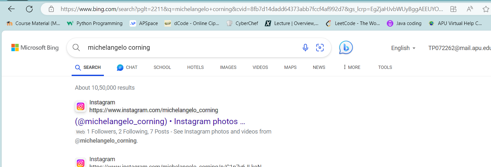
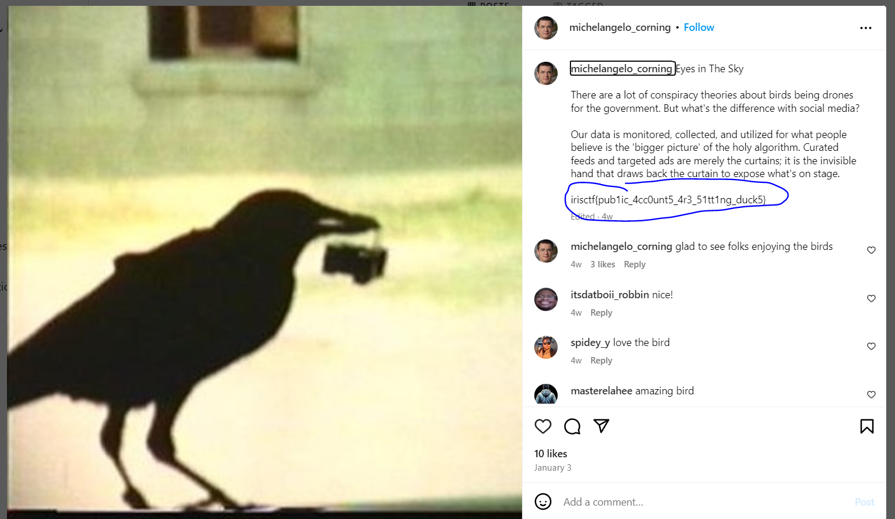

## Away On Vacation - OSI Challenge

# Solution

One of the easier OSI challenges

First I just extracted the file from the away-on-vacation.tar.gz file

I got a mp3 file i ran it and listened to what appears to be an automated message requesting me to contact Michelangelo Corning and i was given an email address that proved useless so I did a simple search on bing for him to get an instagram account in his name

Opened up his instagram file to find the flag on one of his posts

Flag: irisctf{pub1ic_4cc0unt5_4r3_51tt1ng_duck5}

Bingo