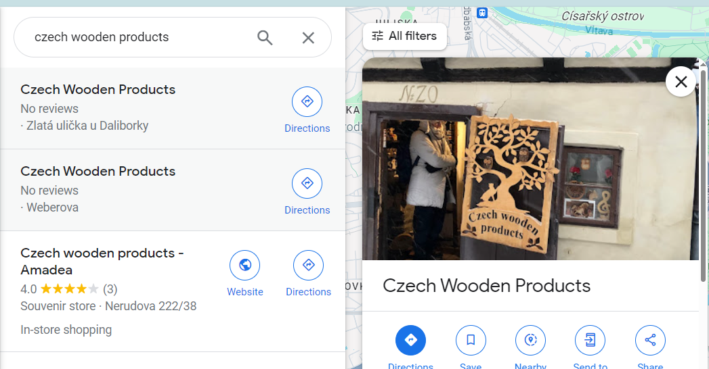

## Czech Where ? - OSI Challenge

# Solution

**Tip:** 'Iris visited this cool shop a while back, but forgot where it was! What street is it on?'

**Hint:** 'FYI: flag is all lowercase and _ for spaces. Please remove all accent marks if there are any. Wrap your answer in irisctf{}.'

Extracted an image from the czech-where.tar.gz

Searched on google maps for 'czech wooden products' cause it is the only identifying part of the image.
Found a similar door on google maps

'Zlatá ulička u Daliborky' found the location of the shop formatted it according to hint

**Flag:** irisctf{zlata_ulicka_u_daliborky}

And Done!